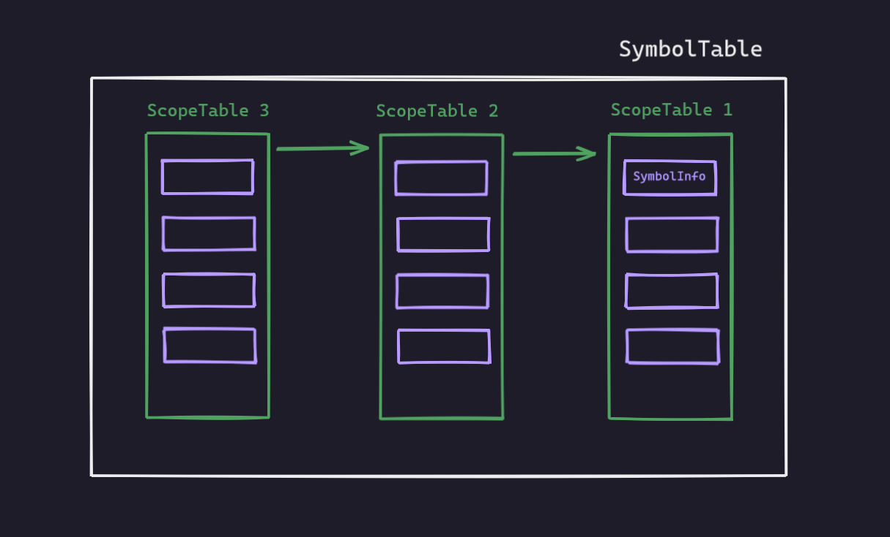

# **`Yet Another C Compiler`**

This is a write-up and a pseudo tutorial written while making this C Compiler. You can follow along and write a compiler of your own. Here I design a compiler for a subset of C language.

If you are here for the code (you know who you are), just want to let you know that the hall of shame will not have mercy upon you.

# Part 1 : **`Creating a Symbol Table`**

The first part needed to make a `Compiler` is a `Symbol Table`. A Symbol Table is a data structure maintained by compilers in order to store information about the occurrence of various entities such as identifiers, objects, function names etc. Information of different entities may include type, value, scope etc. 

At the starting phase of constructing a compiler, we will construct
a Symbol Table which maintains a list of `Hash Tables(Scope Tables)` where each hash table contains information of symbols encountered in a scope of the source program . Each Scope Table will have `Symbol Info` (which will store the information) in it's buckets.

Here is an overview 



Now straight to code . I am showing the declarations here . The full implementation can be found in the code directory.

## `SymbolInfo`

```c++

#ifndef SYMBOLTABLE_H
#define SYMBOLTABLE_H

#include<bits/stdc++.h>
#include "ScopeTable.h"
using namespace std;

template <class T>
string to_str(T x)
{
    stringstream ss;
    ss<<x;
    return ss.str();
}


class SymbolTable
{
    ScopeTable* cur;
    int bucket_size;
    function<int(string)> func;

public:

    template<typename T>
    SymbolTable(int bucket_size,T func) /// constructor
    {
        this->bucket_size = bucket_size;
        this->func = func;

        cur = new ScopeTable(bucket_size,func);
    }

    ~SymbolTable();

    void enter_scope(); /// enter scope  = push : create and push a new ScopeTable
    void exit_scope(); /// exit scope  = pop : remove the current ScopeTable

    bool insert_symbol(SymbolInfo si);
    bool remove_symbol(string key);
    SymbolInfo* lookup(string key);

    void print_current_scope(ofstream &out);
    void print_all_scope(ofstream &out);

    string getCurScopeTableId();

};

#endif // SYMBOLTABLE_H
```

## `ScopeTable`

```c++

#ifndef SCOPETABLE_H
#define SCOPETABLE_H

#include<bits/stdc++.h>
#include "SymbolInfo.h"
using namespace std;

struct ScopeTable
{
    string id;
    int counter;

    ScopeTable* parentScope;

    int M; /* initial hast table size */

    vector<SymbolInfo*>ht;

    function<int(string)> hashValue;

    template<typename T>
    ScopeTable(int table_size,T func)
    {
        id = "1";
        counter = 1;
        parentScope = NULL;

        M = table_size;
        hashValue = func;

        ht = vector<SymbolInfo*>(M);
    }

    ~ScopeTable(); /// destructor

    /// id
    string get_id();
    void set_id(string id);

    /// counter
    int get_counter();
    void set_counter(int counter);
    void increase_counter();

    /// hash
    int hash(string key);

    /// mehtods
    SymbolInfo* search(string key);
    SymbolInfo* insert(SymbolInfo si);
    bool erase(string key);

    /// prints
    void print();
    void printChainLengths();

};

#endif // SCOPETABLE_H

```

## `SymbolTable`

```c++

#ifndef SYMBOLTABLE_H
#define SYMBOLTABLE_H

/* Which of the favors of your Lord will you deny ? */

#include<bits/stdc++.h>
#include "ScopeTable.h"
using namespace std;

template <class T>
string to_str(T x)
{
    stringstream ss;
    ss<<x;
    return ss.str();
}


class SymbolTable
{
    ScopeTable* cur;
    int bucket_size;
    function<int(string)> func;

public:

    template<typename T>
    SymbolTable(int bucket_size,T func) /// constructor
    {
        this->bucket_size = bucket_size;
        this->func = func;

        cur = new ScopeTable(bucket_size,func);
    }

    ~SymbolTable();

    void enter_scope(); /// enter scope  = push : create and push a new ScopeTable
    void exit_scope(); /// exit scope  = pop : remove the current ScopeTable

    bool insert_symbol(SymbolInfo si);
    bool remove_symbol(string key);
    SymbolInfo* lookup(string key);

    void print_current_scope();
    void print_all_scope();

    string getCurScopeTableId();

};

#endif // SYMBOLTABLE_H

```

# Part 2 : **`Lexical Analysis`**

Lexical analysis is the process of scanning the source program as a sequence of characters and converting them into sequences of tokens. A program that performs this task is called a lexical analyzer or a lexer or a scanner.

Here we will use the tool `flex` to do the lexical analysis. Regex is written to do the lexical analysis with flex.

Here is a basic structure of a `lex` file

```
%{
    user code section 1
%}
    definition section
%%
    rules section
%%
    user code section 2
```

Regular Expression is a very powerful tool which we will use in this section to identify the tokens. To check what can be done using regular expression in flex, check [this](https://www.cs.virginia.edu/~cr4bd/flex-manual/Patterns.html) for the rules available in flex. You can also use [regexr.com](https://regexr.com/) to test if your regex performs exactly how you want it to be.

## **`flex` definition**

This is the required syntax for definition :

```
definition_name definition
```

So, we can define things like this :

```c
WHITESPACE [ \t\f\r\v]+ 
LETTER [a-zA-Z_]
DIGIT [0-9]
NEWLINE [\r]?\n
ALNUM [A-Za-z_0-9]
ALL_EXCEPT_BACKSLASH [^\\]
```

## **`flex` rule**

The part that is currently matched can be found in the string `yytext`.

We can write rules using the definitions already defined

```c
{LETTER}{ALNUM}*	{
		cout<<"ID , "<<yytext<<endl;
}
```

or we can completely use new ones

```c
"<"|"<="|">"|">="|"=="|"!="	{
		cout<<"RELOP , "<<yytext<<endl;
}
```

## **`flex` states**

Sometimes it is easy to handle rules for different things separately. Like our life will be much easier if we handle things like `char` `string` or `comment` separately.

To do this we can enter a state by using `BEGIN STATE_NAME` and exit using `BEGIN INITIAL`.

## **`flex` errors**

We can also write regex to identify common errors like "Too many decimal points" , "Ill formed number" or "Invalid ID" etc.

For example a regex for "Too many decimal points" can be something like this

```c
{DIGIT}*(\.{DIGIT}+)\.[0-9\.Ee+-]*(\.)*
```


# Part 3 : **`Parser(Syntax Analysis) & Semantic Analysis`**

The parser obtains a string of tokens from the lexical analyzer and verifies that the string of token names can be generated by the **grammar** for the source language. The parser should also report any syntax errors in an intelligible fashion and recover from commonly occurring errors to continue processing the remainder of the program. 

To make parser for grammar , we will use the tool **`bison`**.  This greatly reduces our work .

Here is a basic structure of a **`bison`** file 

```c
%{
    user code section 1
%}
    bison declarations
%%
    bison grammar rules
%%
    user code section 2
```

## **User Code**

Codes written in this section is directly copied in the resulting `.c` file (`y.tab.c`). Here we include our previously written `SymbolInfo` `ScopeTable` and `SymbolTable` header files. We can also include custom libraries, constants and so on. Most includes and function prototype declarations happen at the top (_user code section 1_) while their actual definition happens at the bottom (_user code section 2_).

## **Stack**

### **Using `YYSTYPE`**

We can hardcode a specific type for the terminals and non-terminals by defining **`YYSTYPE`**. 

```c++
#define YYSTYPE SymbolInfo*
```

and in the lex file, we can write something like this for the tokens

```c++
{integer}	{
				SymbolInfo *s= new  SymbolInfo(yytext,"CONST_INT");
				yylval = (YYSTYPE)s;
				return CONST_INT;
			}
```

### **Using `union`**

Using **`union`**  we can specify types for the terminals(`token`) and non-terminals(`type`) . We have to tell bison the type of that particular `token` / `type` by declaring it inside a special union like this :

```c++
%union{
    SymbolInfo* symbol_info;
    Helper* helper;
}
```

This `union` tells `bison` that when we use a `token` / `type` that is accompanied by **`symbol_info`** then we can use its value like **`SymbolInfo*`**. On the other hand if its accompanied by **`helper`** then that value will be treated as a
**`Helper*`** instead.

It has to be noted that being a `union` and not a `struct` it also means the values use _shared_ memory and not separate segments as opposed to `struct` fields. We can have as many different tags as we want inside the union and both `tokens` and `types` can have the *same* tag.

## **Token**

Terminals are called `token` in Bison. The tokens must be first declared in the parser. Because the tokens are generated in the `y.tab.h` file, then used in the flex file `scanner.l`. Token declarations must be inside bison's `declaration section`. We can use **`YYSTYPE`** or **`union`** to define token types.


### **Using `YYSTYPE`**

```c++
%token ID ADDOP MULOP RELOP LOGICOP
```

### **Using `union`**

```c++
%token < symbol_info > ID ADDOP MULOP RELOP LOGICOP
```

## **Type**

Non-terminals are called `type` in Bison. These non-terminals/state can have a return value, much like `tokens`. We can use **`YYSTYPE`** or **`union`** to define types in the same way.


### **Using `YYSTYPE`**

```c++
%type start program unit variable var_declaration type_specifier
```

### **Using `union`**

```c++
%type < helper > start program unit variable var_declaration type_specifier
```

## **Grammar**

In `bison` we create a *grammar* which syntactically evaluates if the `tokens` that `flex` generated are emitted in a syntactically correct order. In order to do that we will have to take a good look at our language specification and break it down to building blocks that we then have to express using `bison` rules.

Grammar rules in general have the following syntax:

```c++
rule_name:
    caseA
    | caseB
        .
        .
    | caseN
    ;
```

A rule starts by typing its _unique_ name then a colon (`:`) followed by a number of cases which are separated
with a dash `|`; the last rule *must* be followed by a semicolon (`;`). Also rules don't have to be separated
by lines so this would be perfectly legal as well:

```c
rule_name: caseA | caseB | ... | caseN;
```

It is also possible to write action codes:

```c++
func_declaration : type_specifier ID LPAREN parameter_list RPAREN { /** can write code here : known as action code **/ } SEMICOLON
```

The grammar we will use here is the following :

```c++
start : program
	{
		//write your code in this block in all the similar blocks below
	}
	;

program : program unit 
	| unit
	;
	
unit : var_declaration
     | func_declaration
     | func_definition
     ;
     
func_declaration : type_specifier ID LPAREN parameter_list RPAREN SEMICOLON
		| type_specifier ID LPAREN RPAREN SEMICOLON
		;
		 
func_definition : type_specifier ID LPAREN parameter_list RPAREN compound_statement
		| type_specifier ID LPAREN RPAREN compound_statement
 		;				


parameter_list  : parameter_list COMMA type_specifier ID
		| parameter_list COMMA type_specifier
 		| type_specifier ID
		| type_specifier
 		;

 		
compound_statement : LCURL statements RCURL
 		    | LCURL RCURL
 		    ;
 		    
var_declaration : type_specifier declaration_list SEMICOLON
 		 ;
 		 
type_specifier	: INT
 		| FLOAT
 		| VOID
 		;
 		
declaration_list : declaration_list COMMA ID
 		  | declaration_list COMMA ID LTHIRD CONST_INT RTHIRD
 		  | ID
 		  | ID LTHIRD CONST_INT RTHIRD
 		  ;
 		  
statements : statement
	   | statements statement
	   ;
	   
statement : var_declaration
	  | expression_statement
	  | compound_statement
	  | FOR LPAREN expression_statement expression_statement expression RPAREN statement
	  | IF LPAREN expression RPAREN statement
	  | IF LPAREN expression RPAREN statement ELSE statement
	  | WHILE LPAREN expression RPAREN statement
	  | PRINTLN LPAREN ID RPAREN SEMICOLON
	  | RETURN expression SEMICOLON
	  ;
	  
expression_statement 	: SEMICOLON			
			| expression SEMICOLON 
			;
	  
variable : ID 		
	 | ID LTHIRD expression RTHIRD 
	 ;
	 
 expression : logic_expression	
	   | variable ASSIGNOP logic_expression 	
	   ;
			
logic_expression : rel_expression 	
		 | rel_expression LOGICOP rel_expression 	
		 ;
			
rel_expression	: simple_expression 
		| simple_expression RELOP simple_expression	
		;
				
simple_expression : term 
		  | simple_expression ADDOP term 
		  ;
					
term :	unary_expression
     |  term MULOP unary_expression
     ;

unary_expression : ADDOP unary_expression  
		 | NOT unary_expression 
		 | factor 
		 ;
	
factor	: variable 
	| ID LPAREN argument_list RPAREN
	| LPAREN expression RPAREN
	| CONST_INT 
	| CONST_FLOAT
	| variable INCOP 
	| variable DECOP
	;
	
argument_list : arguments
			  |
			  ;
	
arguments : arguments COMMA logic_expression
	      | logic_expression
	      ;
```

## **Accessing `token` and `types`**

Flex returns `tokens` to parser. Parser tries to match grammar rules by shifting one by one and reduced when a rule is matched. `Token` and `types` can be accessed using `$1`, `$2`, ... `$n` where n is the nth item of the rule. Each rule can return a value which is `$$`

```c++
arguments : arguments COMMA logic_expression
    ^           ^       ^           ^
    $$          $1      $2          $3
```

## **Precedence**

There are 4 types of precedence types in `bison` , 3 of which declare both precedence as well as associativity while the last (as its name suggests) declares only precedence. The complete list is the following:

- **`%left`**: Indicates that this operator has *left* associativity (e.g. (a + b) + c is preferred)
    - syntax is: `%left symbols`
- **`%right`**: Indicates that this operator has *right* associativity (e.g. a + (b + c) is preferred)
    - syntax is: `%right symbols`
- **`%nonassoc`**: Indicates that this operator **cannot be seen in sequence** and is considered a *syntax error*
if that's encountered (e.g. a + b + c would throw an error).
    - syntax is: `%nonassoc symbols`
- **`%precedence`**: Indicates just precedence **not** associativity.

## **`Shift/Reduce` Conflict**

This type of conflict happens when `bison` does not know which operation to perform, `shift` or `reduce`. The given grammar has one example of this type of conflict :

```c++
statement : IF LPAREN expression RPAREN statement
	      | IF LPAREN expression RPAREN statement ELSE statement
```

The example of this would be :

```c++
if(x<2) if(x>0) y = 2; else z = 5;
```

Because of the ambiguity, the parser doesn't know if he needs associate the `else` statement with the most recent `if` or not. That is it does not know if it already needs to reduce or continue to process the token `ELSE`

We can solve this using 2 ways:
- rewrite the grammar 
- assign precedence to token 

The first part can be a tough job. Bison gives the opportunity to do the 2nd one.

We can solve this shift/reduce conflict by adding the following in the declaration section:

```c++
%nonassoc LOWER_THAN_ELSE
%nonassoc ELSE
```

and change the grammar rule to this:

```c++
statement : IF LPAREN expression RPAREN statement %prec LOWER_THAN_ELSE
	      | IF LPAREN expression RPAREN statement ELSE statement
```

Here, we are using a dummy token `LOWER_THAN_ELSE` and putting it before `ELSE`, thus making `ELSE` the higher priority one.

## **Freeing Memory : Part 1**

In `C` or `C++`, if you dynamically allocate memory, it is your job to free it yourself. `Bison` has no reasonable obligation to clean-up your mess :)  

Unfortunately most people somehow think that the `bison` (or `flex`) will take care of memory they allocate in the parser, but unfortunately that's not the case.

Let's see an example to demonstrate this. Here is an example rule from the grammar :

```c++
unary_expression: ADDOP unary_expression  {

    print_grammar_rule("unary_expression","ADDOP unary_expression");
    
    $$ = new Helper();
    // update text
    $$->text = $1->key;
    $$->text += $2->text;
    // implicit typecast
    $$->HelperType = $2->HelperType;

    print_log_text($$->text);
}
```

But this implementation is not correct. `$1` represents a `SymbolInfo` pointer which was dynamically allocated in the lex file :

```c++
"+"|"-" { 
            SymbolInfo *s= new  SymbolInfo(yytext, "ADDOP"); 
            yylval.symbol_info = s; 
            return ADDOP;
        }
```

and for `$2` , it was also dynamically allocated in the parser in this rule :

```c++
unary_expression: factor  { 

    print_grammar_rule("unary_expression","factor");
    
    $$ = new Helper();
    // update text
    $$->text = $1->text;
    // implicit typecast
    $$->HelperType = $1->HelperType;

    print_log_text($$->text);
}
```

As mentioned before, if something is dynamically allocated, it's your job to clean that up. So, we need to free `$1` and `$2` when we are done with them.

So, the correct way to write this would be :

```c++
unary_expression: ADDOP unary_expression  {

    print_grammar_rule("unary_expression","ADDOP unary_expression");
    
    $$ = new Helper();
    // update text
    $$->text = $1->key;
    $$->text += $2->text;
    // implicit typecast
    $$->HelperType = $2->HelperType;

    print_log_text($$->text);

    free($1) ; free($2); // freeing dynamically allocated memory
}
```

### **Caution**

But, you need to be careful when you are freeing memory. Imagine inside a rule you have done something like this :

```c++
$$ = $1;
free($1);
```

Here both are pointers. So, what you are essentially doing is making `$$` point to `$1` and freeing `$1` (so, freeing `$$`). Next time you are trying to access `$$`, you will get _**core dumped**_.

Its also handy to write a cleanup function like the following so that we don't accidentally free the ones that have already been freed.

```c++
void eraseMemory_S(SymbolInfo* s) // erase memory of SymbolInfo pointer
{
    if(s!=NULL) free(s);
}

void eraseMemory_H(Helper* h) // erase memory of Helper pointer
{
    if(h!=NULL) free(h);
}

```

# Part 4 : **`Error Recovery`**

During the shift reduce parser phase things _**can**_ and _**will**_ go wrong. This can happen when the parser is unable to match with any of the rules. Under default conditions our parser will terminate after seeing the first error, these are called **`fail-fast parsers`**, but nobody actually wants them ... (except maybe lazy students). This means that if our input has more than one mistake we would only detect the first and exit! This process would get quite tedious as _**repeated compilations would be required**_ in order to detect and fix all errors instead of reporting all errors in our source at the first parse.

Thankfully bison has error recovery capabilities! They are also quite simple to define and explain but require a lot of skill, practice and a hellish insight in order to be used correctly. Otherwise you will add one rule to recover error and get 30-40 shift reduce errors :p So you have to have proper insight about your grammar and handle errors that way. 

One more thing, there is no limit to handling cases. Your user can do mistakes you can never think of. So, it boils down to how many cases you can think of and correct them by adding grammar rules.

For example, your user has written code like this :

```c++
int x-y,z;
```

probably the user wanted to give a `COMMA` but added a `MINUS` instead. If you try to run this with your parser, your parser will immediately stop after encountering this error. Because your parser can't associate to any rule of this type. What you can do is handle the error using the bison `error` token. It is already defined in bison, you don't have to define it. 

We can add a rule to recover from this error :

```c++
declaration_list: declaration_list COMMA ID {
                    // regular rule
                }   
                | declaration_list error COMMA ID {
                    /**
                        To handle errors like :
                            int x-y,z;
                    **/ 
                }
```

The previous `lookahead` token is reanalyzed immediately after an error. If this is unacceptable, then the macro `yyclearin` may be used to clear this token. Write the statement `yyclearin;` in the error rule’s action.

Additionally, after encountering an error it's likely that this fact will then create much more consecutive errors; to avoid this console spam `bison` *suppresses* error messages until 3 consecutive `tokens` have been parsed and shifted successfully. If you don't like (or want) this behavior by default you can put `yyerrok;` inside the `error` rule.

```c++
declaration_list: declaration_list COMMA ID {
                    // regular rule
                }   
                | declaration_list error COMMA ID {
                    /**
                        To handle errors like :
                            int x-y,z;
                    **/ 

                    yyclearin;
                    yyerrok;
                }
```

Just like this, you have to thoroughly think of the corner cases that can happen and handle accordingly.

## **Freeing Memory : Part 2**

So far we have only handled only one part of the memory de-allocation process. As we have seen in the error recovery process, things can go wrong during parsing and we have to account for that. Thankfully `bison` has the ability to clean its own stuff when something does go wrong, but what about *our* dynamically allocated symbols. Thankfully, `bison` has a facility that can help us free-up own resources by calling a `destructor` on each of the discarded symbols, but what does `bison` consider as a *discarded symbol*? The following list is mostly an extract from `bison`'s manual which defines that `bison` considers as ***discarded symbols*** :

Valid ***discarded symbols*** are the symbols that fall into *at least* one of the following categories:

- stacked symbols popped during the first phase of **error recovery**
- incoming terminals during the second phase of **error recovery**
- the current lookahead and the entire stack (except the current right-hand side symbols) in the case the parser is *fail-fast*
- the current lookahead and the entire stack (including the current right-hand side symbols) when the `C++` parser catches an exception in `parse`
- the start symbol when the parser succeeds

Here's how we can do that in our grammar :

```c++
%union{
    SymbolInfo* symbol_info;
    Helper* helper;
}

// specific destructor for <helper> 
%destructor { eraseMemory_H($$); } <helper> 

// specific destructor for <symbol_info> 
%destructor { eraseMemory_S($$); } <symbol_info>

%destructor { /* tagless symbol destructor */ } <>
```

Notice the `tag`-less destructor, which is called on _**every symbol that is present**_. This might raise the question on how to select which destructor to call since there might be more than one. Should `bison` detects that there is a `tag`-specific destructor for a discarded symbol _**it will call that and ignore the more generic one**_, so in case of discarding a symbol that has a semantic value of `<symbol_info>` then only the destructor for `<symbol_info>` will be called.

# Part 4 : **`Intermediate Code Generator`**

For the final piece of this puzzle, we need to write an intermediate code generator on top of our bison code , which will generate 8086 assembly code. We can simulate that using **emu8086** simulator

To do that we can add an extra attribute in out struct `Helper` and add the necessary code for the corresponding grammar. The code is then propagated as usual with the grammar.

Declaring variable can be done in 2 ways. We can put all the variables in the data segment or we can use stack for that. The latter is preferred. 

We can also optimize our code in the following scenario

```
mov ax, a
mov a, ax
```

The second line is redundant and we can simply write

```
mov ax, a
```

Some other optimizations can also be done. For example

```
x = 5;
x = 10;
```
we can ignore the code generated for the first line as that value is never used.

Another optimization can also be made for temporary variables. We can reallocate the temporary variables and ensure efficient use. 